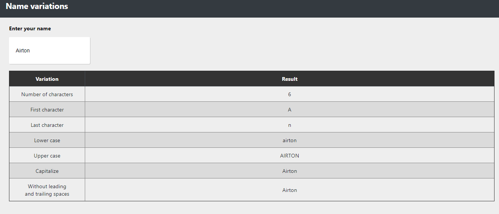

# Strings project - Name Variations

Project learned and based on Strings Project [Learn JavaScript](https://learnjavascript.online) course.  

The objective is to show some strings methods in Javascript: toUpperCase, toLowerCase, trim, etc.

